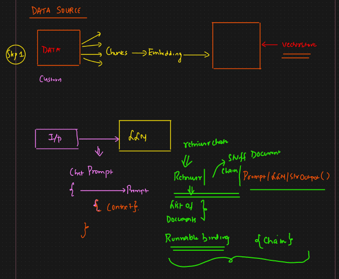

# Basic RAG

* We design prompt ⇒ Here we are using chatprompttemplate
* We need to add context to it
* Context is coming from vectorstore
* chain = prompt|LLM|stroutputparser
* We also need to integrate vector DB
* So we convert it into retriever
* We need to use retriever chain to pass the retriever to chain
* Output of retriever is list of documents
* To combine the document we use stuff document chain
* Since prompt|LLM|stroutput will be fixed
*   And retriever and chain is dynamic so that's why its runnable binding

    <figure><figcaption></figcaption></figure>
