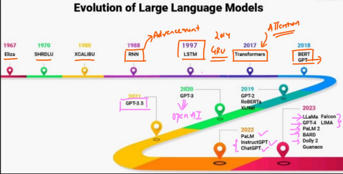

# ✈️ Evolution of LLM models

* 1967 - Eliza
* 1988 - Advancement started ⇒ RNN
* 1997 ⇒ LSTM
* 2014 ⇒ GRU
* 2017 ⇒ Transformers&#x20;
* 2018 ⇒ BERT, GPT models
* 2019 ⇒ GPT2, RoBERTa
* 2020 ⇒ GPT3 ⇒ OpenAI
* 2021  ⇒ GPT3.5
* 2022 ⇒ PaLM
* 2023 ⇒ Meta also joined the game
* 2024 ⇒ OpenAI has come up with multi model GPT4, Google gemini pro 1.5
*

    <figure><figcaption></figcaption></figure>
