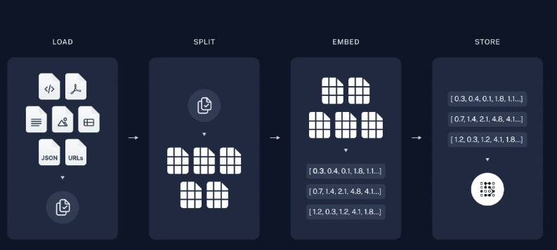

# 🟢 Introduction to Basic components and modules in LangChain

1. <mark style="color:purple;background-color:purple;">**RAG: Retrieval Augmented Generation**</mark>

* Retrieval-Augmented Generation (RAG) is a framework that combines:

1. **Information Retrieval**: Fetching relevant data or documents from an external knowledge base.
2. **Generative AI Models**: Producing contextually relevant responses using retrieved information.

* Data source is thousand of pdf and we want to make GenAI app to query the pdf and give response
* <mark style="color:purple;background-color:purple;">**Load(Data Ingestion):**</mark>
  * So first we need to load the data, which can be from different sources which we do in Load (Data Ingestion)
* <mark style="color:purple;background-color:purple;">**Split (Data Transformation):**</mark>
  * <mark style="color:purple;background-color:purple;">**Split the data into smaller chunks**</mark>
  * <mark style="color:purple;background-color:purple;">**We split, coz we will be using LLM models and it has some limitation to context size**</mark>
* <mark style="color:purple;background-color:purple;">**Embed:**</mark>
  * <mark style="color:purple;background-color:purple;">**Convert text into vectors**</mark>
* <mark style="color:purple;background-color:purple;">**Store**</mark>
  * <mark style="color:purple;background-color:purple;">**To store the vectors**</mark>
  * There are different vector store ⇒ FAISS, CHROMADB, ASTRADB
*

    <figure><figcaption></figcaption></figure>

2. **User Interaction:**

* User will be able to ask any Question
* We design a separate prompt
* <mark style="color:purple;background-color:purple;">**As soon as we give question, it is queries to vector store**</mark>&#x20;
* <mark style="color:purple;background-color:purple;">**Retrieval chain is responsible in querying vector store DB**</mark>
* <mark style="color:purple;background-color:purple;">**We will combine this context info with prompt and give it to LLM**</mark>

<figure><figcaption></figcaption></figure>
