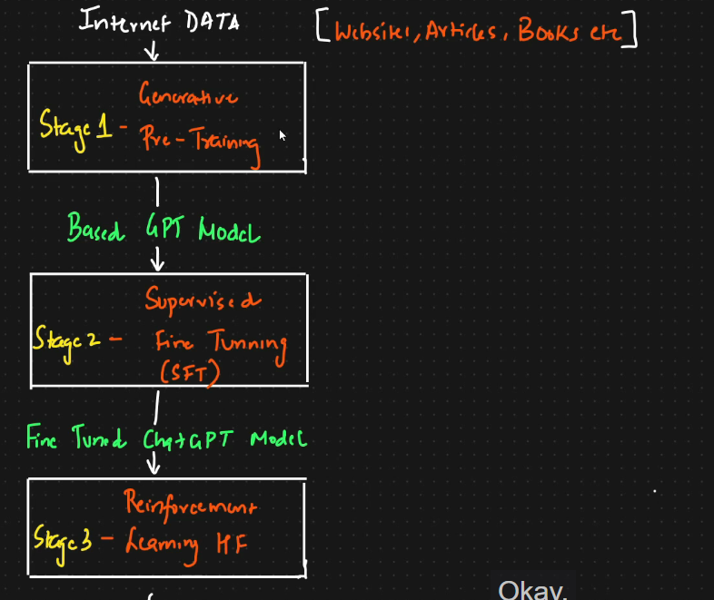
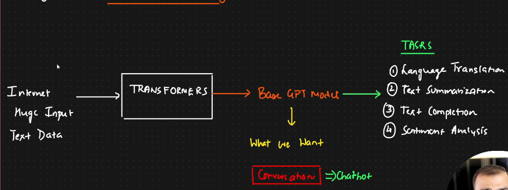
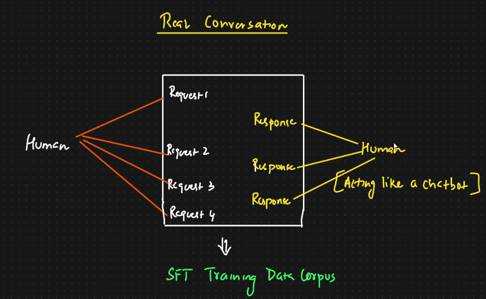
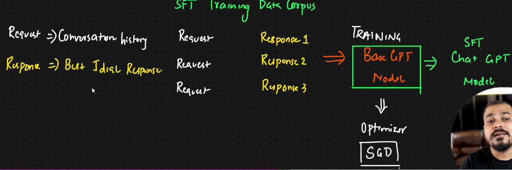
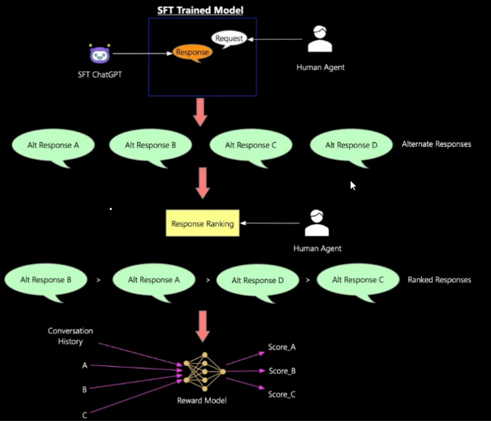
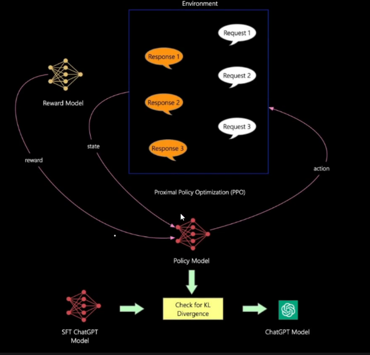

# 🟠 How OpenAI ChatGPT or Llama3 LLM models are trained

ChatGPT:

* Trained in 3 stages
*

    <figure><figcaption></figcaption></figure>
* <mark style="color:purple;background-color:purple;">**Stage 1: Generative Pre-Training**</mark>
  * Entire internet data like website, articles, books etc are used to train&#x20;
  * We pass the data to transformer
  * It gives a base GPT model&#x20;
  * <mark style="color:purple;background-color:purple;">**Trained on task like language translation, text summarization, text completion, sentiment analysis**</mark>
  * Our main aim is to use this model for conversation - Chatgpt
  *   So we need to convert this subtasks in the form of request and response

      <figure><figcaption></figcaption></figure>
* <mark style="color:purple;background-color:purple;">**Stage 2: Supervised fine tuning**</mark>
  * <mark style="color:purple;background-color:purple;">**On one side human being will be there**</mark>
  * <mark style="color:purple;background-color:purple;">**There will be another human who will be acting like a chatbot**</mark>&#x20;
  *   <mark style="color:purple;background-color:purple;">**This all conversation will be getting captured and will be getting converted into training corpus**</mark>

      <figure><figcaption></figcaption></figure>
* For same request, there can be multiple responses also
* There will be millions of records
* This will be sent to BaseGPT model for training
* After optimization we will get supervised fine tuned model
*   <mark style="color:purple;background-color:purple;">**If it is asked some question which was not there in training data, then we might not get correct data**</mark>

    <figure><figcaption></figcaption></figure>

<mark style="color:purple;background-color:purple;">**Stage 3: Reinforcement learning through human feedback**</mark>

* This has increased the accuracy of chatgpt
* <mark style="color:purple;background-color:purple;">**Human asks question, SFT gpt gives response**</mark>
* <mark style="color:purple;background-color:purple;">**For same request, we may have multiple response**</mark>
* <mark style="color:purple;background-color:purple;">**Once we get multiple response, human will rank the responses**</mark>
* <mark style="color:purple;background-color:purple;">**Based on this, we create a reward model, so for each response it will give a score and this will be based on probability**</mark>
* It probability is low then response is not good, if it is high then response is good
*

    <figure><figcaption></figcaption></figure>
* Once reward model is created, then reinforcement is applied by proximal policy optimization
* Reward model updates the rewards based on the response that is coming from chatgpt model&#x20;
* It will update the specific rewards using this proximal policy optimization technique
*

    <figure><figcaption></figcaption></figure>
