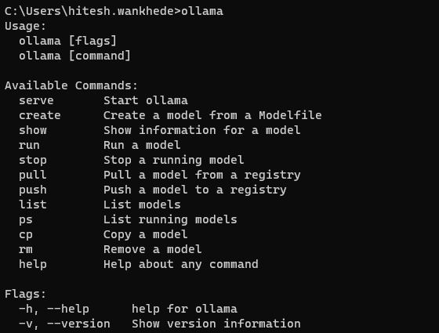

# 🟢 Ollama Embeddings

* Ollama can be used for downloading and running open source LLMs on local system
* You should have at least 8 GB of RAM available to run the 7B models, 16 GB to run the 13B models, and 32 GB to run the 33B models.
* <mark style="color:purple;background-color:purple;">**Ollama is for using opensource embeddings / LLMs**</mark>
* [<mark style="color:purple;background-color:purple;">**https://ollama.com/**</mark>](https://ollama.com/) <mark style="color:purple;background-color:purple;">**⇒ Download**</mark>
* [<mark style="color:purple;background-color:purple;">**https://github.com/ollama/ollama**</mark>](https://github.com/ollama/ollama)
* <mark style="color:purple;background-color:purple;">**Command prompt ⇒ ollama pull nomic-embed-text ⇒ to download the model**</mark>
* <mark style="color:purple;background-color:purple;">**Can also run deepseek**</mark>
* <mark style="color:purple;background-color:purple;">**When we run it we can also see \<think> ....\</think> ⇒ Coz its a reasoning model**</mark>
*

    <figure><figcaption></figcaption></figure>
* <mark style="color:purple;background-color:purple;">**Once done we can directly interact with the model**</mark>
* <mark style="color:purple;background-color:purple;">**Ollama supports embedding models, making it possible to build retrieval augmented generation (RAG) applications that combine text prompts with existing documents or other data.**</mark>
* <mark style="color:purple;background-color:purple;">**embed\_query, embed\_documents ⇒ to create embeddings**</mark>

```python
from langchain_community.embeddings import OllamaEmbeddings

embeddings=(
    OllamaEmbeddings(model="gemma:2b")  ##by default it ues llama2
)

r1=embeddings.embed_documents(
    [
       "Alpha is the first letter of Greek alphabet",
       "Beta is the second letter of Greek alphabet", 
    ]
)

len(r1[0]) # 2048

embeddings.embed_query("What is the second letter of Greek alphabet ")

### Other Embedding Models
### https://ollama.com/blog/embedding-models
embeddings = OllamaEmbeddings(model="mxbai-embed-large")
text = "This is a test document."
query_result = embeddings.embed_query(text)
query_result
```
