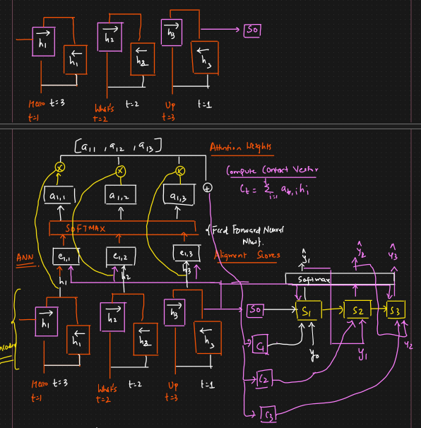

# 🔴 Attention Mechanism - Seq2Seq

* The idea is that for longer sentence we will pass context vector and additional context as well
* <mark style="color:purple;background-color:purple;">**From encoder we get hidden state - S0 and C - Context vector**</mark>
*

    <figure><figcaption></figcaption></figure>
* **Attention Mechanism:**
* In the encoder, we will be using bi directional LSTM
* In 1st RNN data will go t1 to t3 and in 2nd it will go t3 to t1
* The outputs of both the RNNs will be combined
* S0 is the hidden state
* h1, h2, h3 will be output, we will convert it into some context and then give it to the decoder
* <mark style="color:purple;background-color:purple;">**The idea is to create a new context vector every timestep on the decoder which attends differently to the encoded sequence**</mark>
* We will pass h1 and S0, h2 and S0 and h3 and S0
* Lets call it as e11, e12, e13 ⇒ Allignment scores
* Then we pass it to a softmax ANN
* This will give us a11, a12 and a13 ⇒ This decides how much context vector of each output to be taken
* We multiply a11 and h1 ... to get attention scores
* We will combine this values and get context vector
* In decoder we will give y0, S0 and C1 and we will get ypred
* From S1 we need to pass information from S1 to S2
* Now for S2, we will take the hidden state of S1 and pass it to get e and so on, this will give us C2
* This will continue for the remaining time stamp
*

    <figure><figcaption></figcaption></figure>
