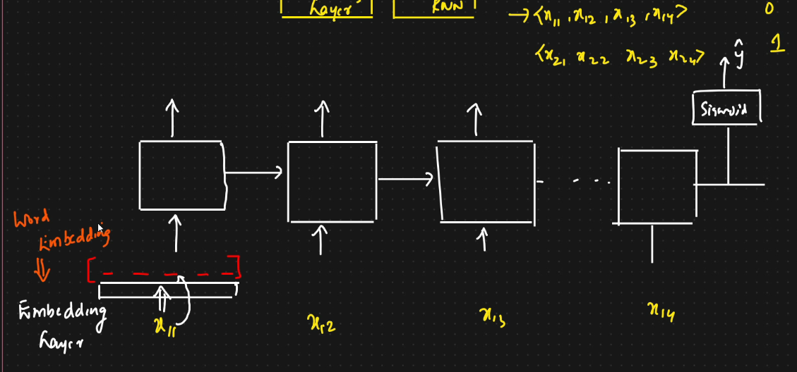

# Problem Statement

* IMDB dataset
  * Reviews       Output (Positive/Negative)
* Using simple RNN
* Dataset ⇒ Feature Extraction ⇒ Simple RNN ⇒ Save the model in .h5 file ⇒ Streamlit web app ⇒ Deployment
* We also need to use embedding layer here
* Embedding Layer: To convert words into vectors with some dimensions
*

    <figure><figcaption></figcaption></figure>
