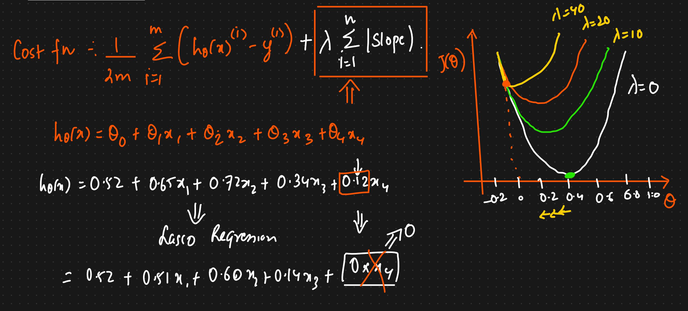

# Practical - Simple Linear Regression


```python
df=pd.read_csv('height-weight.csv') # Read the csv file
df.head() # Read the 1st 5 records

# Check the relationship between independent and dependent variables
##scatter plot
plt.scatter(df['Weight'],df['Height'])
plt.xlabel("Weight")
plt.ylabel("Height")
# We can see linear relationship as weight is increasing with height

## Correlation
df.corr()
# Here we will get that height and weight are highly correlated
sns.pairplot(df) # here we can also plot using seaborn

## Independent and dependent features
X=df[['Weight']] ### independent features should be data frame or 2 dimesnionalarray
y=df['Height'] ## this variiable can be in series or 1d array
# Split
X_train,X_test,y_train,y_test=train_test_split(X,y,test_size=0.25,random_state=42)

# We always want X as dataframe or array
# Y can be series or 1D array

## Standardization
scaler=StandardScaler()
X_train=scaler.fit_transform(X_train)
X_test=scaler.transform(X_test)


# Linear Regression
regression=LinearRegression(n_jobs=-1)
regression.fit(X_train,y_train)
print("Coefficient or slope:",regression.coef_)
print("Intercept:",regression.intercept_)

## plot Training data plot best fit line
plt.scatter(X_train,y_train)
plt.plot(X_train,regression.predict(X_train))

y_pred=regression.predict(X_test)
## Performance Metrics
from sklearn.metrics import mean_absolute_error,mean_squared_error
mse=mean_squared_error(y_test,y_pred)
mae=mean_absolute_error(y_test,y_pred)
rmse=np.sqrt(mse

score=r2_score(y_test,y_pred)
#display adjusted R-squared
1 - (1-score)*(len(y_test)-1)/(len(y_test)-X_test.shape[1]-1)


##### Using OLS #######
import statsmodels.api as sm

model=sm.OLS(y_train,X_train).fit()
prediction=model.predict(X_test)
print(model.summary())

## Prediction For new data
# Always standardize the test data also
regression.predict(scaler.transform([[72]])) -> array([155.97744705])
```

* Using seaborn
*

    <figure><figcaption></figcaption></figure>
* We have to do standardization because, the different features can be in different units, as we have to use gradient descent, so if one of the feature is having big blue then it will long time to reach global minima
* We need to do it for independent features, not required for dependent features
* While using standardization, we use train data only, coz we dont want our model to see the test data, otherwise it will be data leakage
* Plot of prediction
*

    <figure><figcaption></figcaption></figure>
* y\_pred\_test =156.470 + 17.29(X\_test)
* OLS Model summary
*

    <figure><figcaption></figcaption></figure>
*
