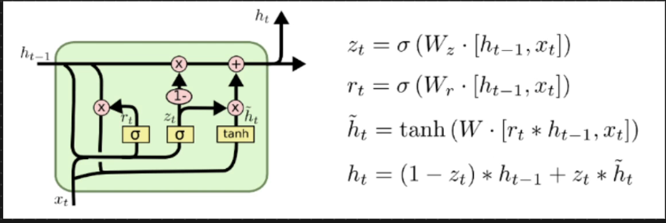

# GRU RNN

* 2014
* In LSTM we have separate long term memory and short term memory
* LSTM architecture is complex, as we are using 3 different gates and candidate memory as well. so there are 3 important weight Wf, Wi and Wo
* So the trainable parameters is high
* So training time will also increase
* Instead of using short term and long term memory, it has been combined in GRU
* Zt is called as update gate
* Rt is called as reset gate
* H\~t is called as temporary hidden state
* Rt is done point wise operation with Ht-1 and this is send to tanh to get temporary hidden state
* This is done pointwise operation with Zt and it is again done point wise operation we update Ht
* We subtract some information with Ht-1
*

    <figure><figcaption></figcaption></figure>
* Reset Gate: Will be responsible in resetting some information from Ht-1
* Update Gate: What context info needs to be added
* To update ht, using (1 - Zt )\* ht we will remove context and using Zt\*Ht we will add context
