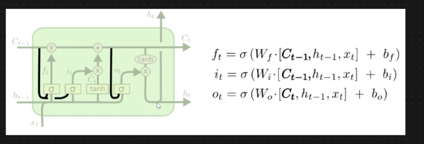

# Variants of LSTM RNN - Peephole

* Introduced by Gers and Schmidhuber in 2000
* Ct-1 has been passed to Input gate and forget gate
* Ct has been passed to output gate
* This connections are known as Peephole connections
*

    <figure><figcaption></figcaption></figure>

**Peephole Connection:**&#x20;

* Through this architecture we let the gate layers look at the cell state
* It means we are also letting it look at the memory and then decide what to forget and what to add
* This probably gives better results
