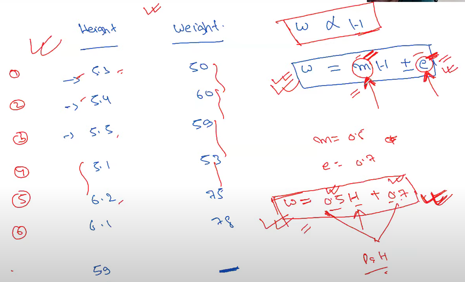

# Lasso

* Also called L1 regularization
* Used for feature selection
* Here we take mod of slope
* The feature which are not important their coefficient will get reduced to 0
* &#x20;if we increase lambda theta are decreasing
* But there will come a point when shifting the lambda will make the coefficients as 0
* So the unimportant coefficients will become 0
* &#x20;
*

    <figure><figcaption></figcaption></figure>
