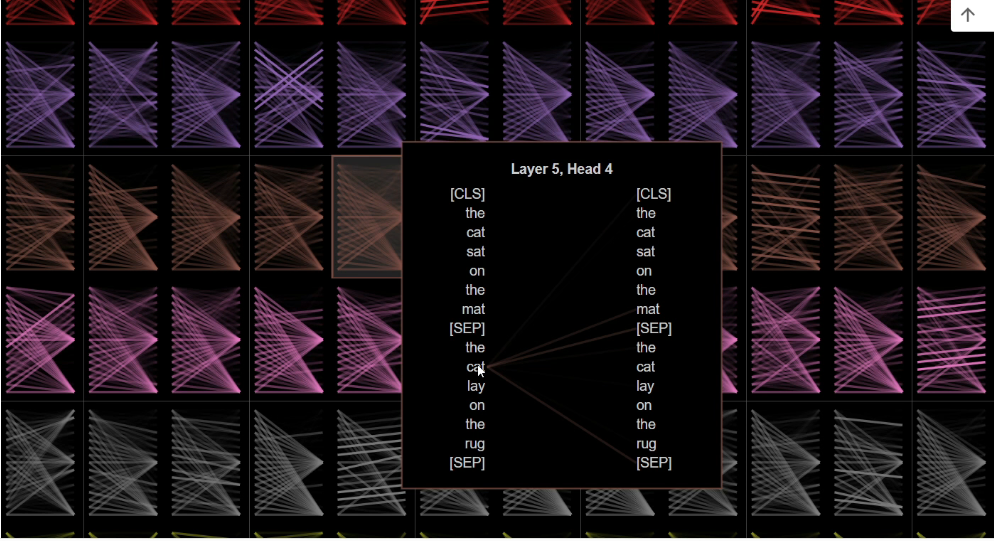

# 🟠 Feed Forward NN with Multi Head Attention

* For every word, we will be getting multiple attention heads ⇒ Z1, Z2..... ⇒ If there are 8 attention heads then we will get 8Z
* We need to pass all this to feed forward NN
* <mark style="color:purple;background-color:purple;">**We need to combine all the context vectors from all the attention heads before sending it to NN and then do forward and backward propagation**</mark>
*

    <figure><figcaption></figcaption></figure>
* Every head will have different Q,K and V
*   <mark style="color:purple;background-color:purple;">**We concatenate all the attention heads, we do a dot product W0 ⇒ This will give us Z**</mark>

    <figure><figcaption></figcaption></figure>
*

    <figure><figcaption></figcaption></figure>
*   &#x20;

    <figure><figcaption></figcaption></figure>
* Here we can see that with respect to every word, for every encoder and every head, how much importance each word gives to other word
*

    <figure><figcaption></figcaption></figure>
