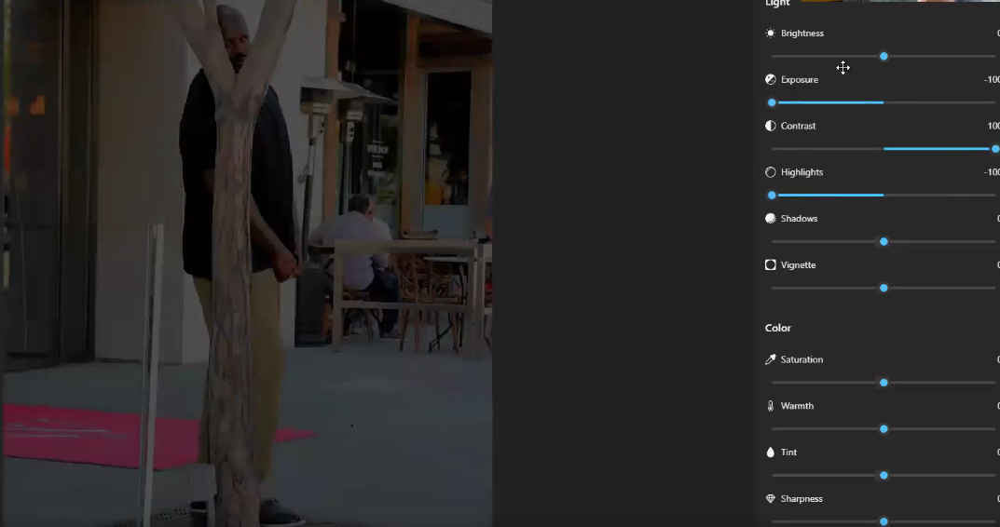

# Illumination / Exposure

* Under exposed
  *   Exposure, highlight is decreased

      <figure><figcaption></figcaption></figure>
* Over exposed
  * Increased highlights and exposure
  *   We can see here that pant is not oven distinguishable

      <figure><figcaption></figcaption></figure>
* At night cameras don't work in RGB and it starts working on IR, which will give grayscale image
* With OpenCV we will detect whether the image is RGB or IR
*   We will train a model for RGB and another for IR

    <figure><figcaption></figcaption></figure>
