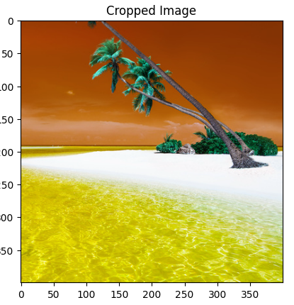

# 🟢 Cropping an image

<mark style="color:purple;background-color:purple;">**Cropping is done by slicing the image array**</mark>

<mark style="color:purple;background-color:purple;">**The top leftmost point of image is 0,0**</mark>

* <mark style="color:purple;background-color:purple;">**image\[y1:y2, x1:x2]**</mark>
* <mark style="color:purple;background-color:purple;">**y1:y2: Defines the height**</mark>
* <mark style="color:purple;background-color:purple;">**x1:x2: Defines the width**</mark>

```python
# Cropping an image
cropped_image = image[200:600, 200:600]

print(cropped_image.shape)

plt.imshow(cropped_image)
plt.title("Cropped Image")
plt.show()
```

*

    <figure><figcaption></figcaption></figure>
