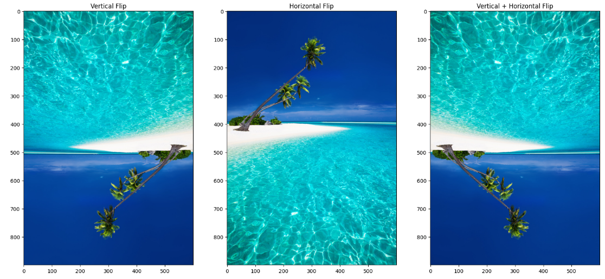

# 🟢 Flipping Image

<mark style="color:purple;background-color:purple;">**Syntax : image = cv2.flip(img, flipCode)**</mark>

* flipCode = 0: Flips the image vertically (around the x-axis).
* flipCode = 1: Flips the image horizontally (around the y-axis).
* flipCode = -1: Flips the image both vertically and horizontally (180-degree rotation)

```python
image_f = cv2.cvtColor(image, cv2.COLOR_BGR2RGB)

# Flip
flipped_v = cv2.flip(image_f, 0)  # Vertical flip

flipped_h = cv2.flip(image_f, 1)  # Horizontal flip

flipped_vh = cv2.flip(image_f, -1)  # Horizontal flip

# Display the result
plt.figure(figsize=(20, 16))

plt.subplot(1, 3, 1)
plt.imshow(flipped_v)
plt.title("Vertical Flip")

plt.subplot(1, 3, 2)
plt.imshow(flipped_h)
plt.title("Horizontal Flip")

plt.subplot(1, 3, 3)
plt.imshow(flipped_vh)
plt.title("Vertical + Horizontal Flip")

# Adjust the space between subplots
plt.subplots_adjust(hspace=0.5)  # Increase hspace for more vertical spacing
```

<figure><figcaption></figcaption></figure>
