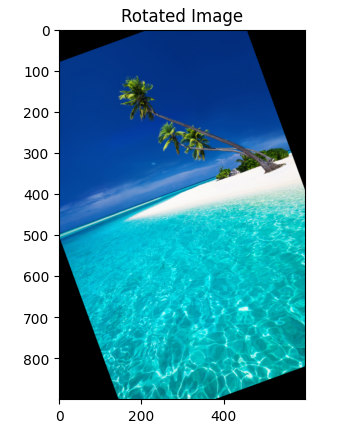

# 🟠 Image Rotation 2

* <mark style="color:purple;background-color:purple;">**If we rotate by 20 degree then we wont get rhombus, but we will get space replaced with black pixels**</mark>
* <mark style="color:purple;background-color:purple;">**getRotationMatrix2D() function generates a 2D rotation matrix that can be used to rotate an image around a specified center point by a given angle.**</mark>
  * M = cv2.getRotationMatrix2D(center, angle, scale)
  * center : A tuple (x, y) representing the center point around which the image will be rotated.
  * angle : The angle of rotation in degrees. Positive values indicate counter-clockwise rotation, while negative values indicate clockwise rotation.
  * scale : A scaling factor. A value of 1 means no scaling, values greater than 1 increase the size of the image, and values less than 1 decrease the size.
  * Returns a 2x3 rotation matrix that can be used with cv2.warpAffine() to apply the rotation to an image.
* <mark style="color:purple;background-color:purple;">**cv2.warpAffine() function applies an affine transformation to an image. It can be used to perform various transformations such as rotation, translation, and scaling.**</mark>
* dst = cv2.warpAffine(src, M, dsize)
* src : source image
* M : The 2x3 transformation matrix, which can be obtained from cv2.getRotationMatrix2D() or other transformation functions.
* dsize : The size of the output image as a tuple (width, height). This specifies the dimensions of the resulting image after the transformation.
* Returns the transformed image.

Affine transformations can be represented using a 2x3 transformation matrix.

Common Affine TRansformation

* Translation : Moves every point of an image or shape by the same amount in a specified direction.
* Scaling : Resizes an image or shape by a scaling factor.
* Rotation : Rotates an image or shape around a specified point (often the center).
* Shearing : Slants the shape of an object along the x or y axis.

The 2x3 transformation matrix is essential in image processing for performing complex transformations in a compact and efficient manner. By manipulating the elements of this matrix, you can achieve various effects such as rotation, scaling, translation, and more.

* m00, m11 are scaling factors.
* m01, m10 are used for shearing and rotation.
* m02, m12 are used for translation. ​ are scaling factors.

x\_c, y\_c is the center point around which the rotation occurs.

```python
image = cv2.imread('./data/beach-blue.jpg')

image_rgb = cv2.cvtColor(image, cv2.COLOR_BGR2RGB)

height, width = image_rgb.shape[:2]
print("Height and width of original image", height, width)

# get the coordinates of the center of the image to create the 2D rotation matrix
center = (width/2, height/2)

# using cv2.getRotationMatrix2D() to get the rotation matrix
rotate_matrix = cv2.getRotationMatrix2D(center=center, angle=20, scale=1)

# rotate the image using cv2.warpAffine
rotated_image = cv2.warpAffine(src=image_rgb, M=rotate_matrix, dsize=(width, height))

plt.imshow(rotated_image)
plt.title("Rotated Image")
plt.show()


```

<figure><figcaption></figcaption></figure>
