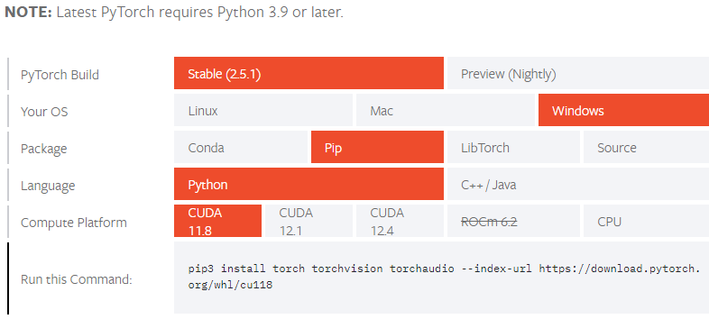

# Pytorch

* DL framework&#x20;
* It has concepts like
  * Back propagation
  * Optimizer
  * Loss function
  * CUDA compatibility built in
  * and lot more
* It also supports distributed GPU training - Multiple GPU can be used to train the model
  * We can put multiple GPUs in a grid, if there are 4 GPUs of 4GB then we can train a bigger model using 16GPU
* Torch original bindings are in C++, the python version of it is pytorch
* So we can even export the model in C++

<figure><figcaption></figcaption></figure>

**CUDA:**

* Parallel computing platform and API developed by nvidia
* Provides tools like matrix multiplication
* Operations perform in parallel so its faster
* High performance computing - helps in image processing, scientific computing etc
* It has lot of memory so it can be used for large scale memory computing
* CPU has less cores (i5 has 4 to 6 core), whereas GPU has more cores (3000 cores)
* CUDA is already integrated with pytorch so that it interface with nvidia GPU
* CUDA is dependent in GPU, if GPU is latest then it will have latest CUDA version
* GPU mentions which CUDA it supports, so as per it only we should install CUDA
* Always select higher GPU RAM

<pre class="language-python"><code class="lang-python"><strong>!nvidia-smi # to check GPU 
</strong></code></pre>

**GPUs:**

* TPU is googles own processing unit
* 3060, 4070 is used mostly
* T4, A100 is commercial grade, even if they have the same RAM as above still this will be faster
