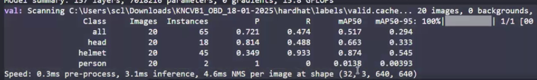

# Yolo

* Clone yolov5 repo
* Install yolov5
* Download data from roboflow - hardhat - raw version
* While downloading using yolov5 sample
* It has train test, test and val folders and each folder has images and labels
* data.yaml ⇒ has information about number of classes and lables
* We keep images and labels in different structure, coz so that if data annotation team makes any correction then they would have to store only labels.txt
* We can convert from coco annotation to yolo annotations also
*

**Project Structure:**

hardhatdata

* images
  * train
    * image1
    * image2
  * test
    * image3
    * image4
  * val
    * image5
    * image6
* labels
  * train
    * image1.txt ⇒ it will contain the index and its bounding box info, in 1 image there can be multiple object instances
    * image2.txt
  * test
    * image3.txt
    * image4.txt
  * val
    * image5.txt
    * image6.txt

yolo

* copy coco.yaml ⇒ hardhat.yaml ⇒ replace class names here and data path

* cd yolov5
* python train.py --weights "yolov5s.pt" --data "hardhatdata.yaml" --epochs 5 --device 0
* Better to train on GPU
*   In val we have 20 images, in which there are total 65 instances (18 of head, 45 of helmet....), we also have precision and recall here

    <figure><figcaption></figcaption></figure>
* export.py ⇒ to convert pt model to torch script/onnx etc
* detect.py ⇒ for inferecing
* val.py to check the performance of the model on new dataset
  * python val.py --weights <\<path of the trained last/best weights>> <\<device>>
  *

      <figure><figcaption></figcaption></figure>
* runs ⇒ detect ⇒ all the inferences
* runs ⇒ trains ⇒ all the training done till now, confusion matrix etc
* yolo calculates last and best weight
* Last epoch might not have the best accuract, we need to use best accuracy

**Steps:**

1. Clone yolov5 repo
2. Install all the libraries
3. Download dataset
4. Restructure dataset
   1. Hardhat
      1. images
         1. train
         2. test
         3. val
      2. labels
         1. train
         2. test
         3. val
5. Create yaml file
   1. mention root directory
   2. train: images/train
   3. val: images/valid
   4. test: images/valid
6. yolov5/train ⇒ mention the weights, epochs, yaml file, device,&#x20;
