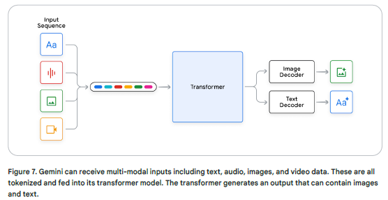

# Gemini

*

    <figure><figcaption></figcaption></figure>
* state-of-the-art multimodal language family of models that can
  &#x20;take interleaved sequences of text, image, audio, and video as input
* 2M tokens in the Gemini Pro version
  &#x20;on Vertex AI
* Different sizes: Gemini Ultra, Gemini Pro, Gemini
  &#x20;Nano and Flash
