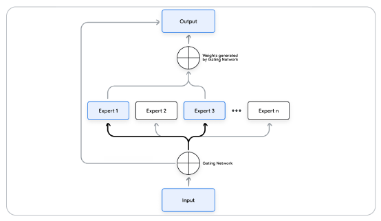

# Mixture of Experts - MoE

* Combines multiple specialized sub models to improve overall performance
* It’s
  &#x20;a form of ensemble learning, but instead of simply aggregating it learns to route different parts of the input to different experts.
* This allows the model to specialize, with each expert becoming proficient in a specific
  &#x20;sub-domain

**Experts:** LLM

**Router:**&#x20;

* NN which learns to route the input to appropriate expert
* Produces a probability distribution over the experts,
  &#x20;indicating how much each expert should contribute to the final result.&#x20;
* These probabilities
  &#x20;then weight the outputs of the experts, and the weighted combination becomes the final
  &#x20;prediction

<figure><figcaption></figcaption></figure>
