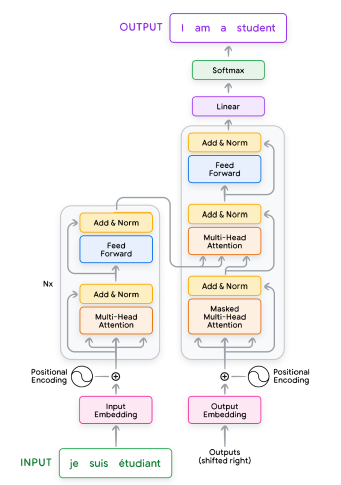

# Transformers

* Developed by Google in 2017
* seq2seq model
* Consists of encoder and decoder
* Encoder converts the input text into representation which is passed to the decoder
* Decoder uses this representation to generate the output
* Consists of multiple layers which include Multi-Head attention, Add and Norm, Feed forward, Linear, Softmax etc
*

    <figure><figcaption></figcaption></figure>
