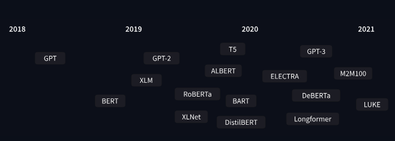

# 🟢 Transformer History

*

    <figure><figcaption></figcaption></figure>
*
  * **June 2018**: [GPT](https://cdn.openai.com/research-covers/language-unsupervised/language_understanding_paper.pdf), the first pretrained Transformer model, used for fine-tuning on various NLP tasks and obtained state-of-the-art results
  * **October 2018**: [BERT](https://arxiv.org/abs/1810.04805), another large pretrained model, this one designed to produce better summaries of sentences (more on this in the next chapter!)
  * **February 2019**: [GPT-2](https://cdn.openai.com/better-language-models/language_models_are_unsupervised_multitask_learners.pdf), an improved (and bigger) version of GPT that was not immediately publicly released due to ethical concerns
  * **October 2019**: [DistilBERT](https://arxiv.org/abs/1910.01108), a distilled version of BERT that is 60% faster, 40% lighter in memory, and still retains 97% of BERT’s performance
  * **October 2019**: [BART](https://arxiv.org/abs/1910.13461) and [T5](https://arxiv.org/abs/1910.10683), two large pretrained models using the same architecture as the original Transformer model (the first to do so)
  * **May 2020**, [GPT-3](https://arxiv.org/abs/2005.14165), an even bigger version of GPT-2 that is able to perform well on a variety of tasks without the need for fine-tuning (called zero-shot learning)

3 Categories:

* GPT-like (also called _auto-regressive_ Transformer models)
* BERT-like (also called _auto-encoding_ Transformer models)
* BART/T5-like (also called _sequence-to-sequence_ Transformer models)
