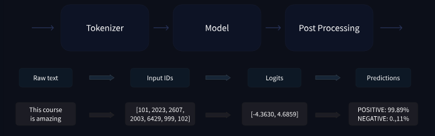

# 🟠 Behind the pipeline

* <mark style="color:purple;background-color:purple;">**Pipeline does 3 steps ⇒ Preprocessing, Passing inputs to the models and post processing**</mark>
*

    <figure><figcaption></figcaption></figure>
* **Tokenizer:**
  * Splitting input into tokens
  * <mark style="color:purple;background-color:purple;">**Mapping each token to an integer**</mark>
  * <mark style="color:purple;background-color:purple;">**All the preprocessing should be done the same way as done using pre training so we use AutoTokenizer class and use the name of our model in it**</mark>
  * Output of tokenizer can be directly given to the model
  * We need to specify the type of tensors which we want
* <mark style="color:purple;background-color:purple;">**Going through the model:**</mark>
  * Use AutoModel class
  * <mark style="color:purple;background-color:purple;">**It outputs what we’ll call hidden states, also known as features.**</mark> For each model input, we’ll retrieve a high-dimensional vector representing the contextual understanding of that input by the Transformer model.

```python
from transformers import AutoModel

checkpoint = "distilbert-base-uncased-finetuned-sst-2-english"
model = AutoModel.from_pretrained(checkpoint)
```

* A high dimensional vector:
  * The vector output by the Transformer module is usually large. It generally has three dimensions:
    * <mark style="color:purple;background-color:purple;">**Batch size: The number of sequences processed at a time (2 in our example).**</mark>
    * <mark style="color:purple;background-color:purple;">**Sequence length: The length of the numerical representation of the sequence (16 in our example).**</mark>
    * <mark style="color:purple;background-color:purple;">**Hidden size: The vector dimension of each model input.**</mark>

```python
outputs = model(**inputs)
print(outputs.last_hidden_state.shape)
# torch.Size([2, 16, 768])
```

* Model heads:
  * <mark style="color:purple;background-color:purple;">**The output of transformer model is sent to the model head to be processed**</mark>
  *

      <figure><figcaption></figcaption></figure>
