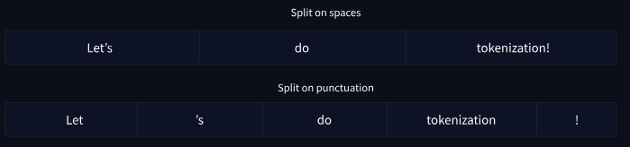

# Tokenizer

* To convert our text inputs to numerical data
* Each word gets assigned an ID, starting from 0 and going up to the size of the vocabulary. The model uses these IDs to identify each word.
* <mark style="color:purple;background-color:purple;">**“unknown” token, often represented as ”\[UNK]” or ””**</mark>

**Word Based:**

* Split on spaces

```python
tokenized_text = "Jim Henson was a puppeteer".split()
print(tokenized_text)
# ['Jim', 'Henson', 'was', 'a', 'puppeteer']
```

* Split on punctuation
*

    <figure><figcaption></figcaption></figure>
* The number of tokens can be huge as the vocabulary can be very high, so we can also use character based tokenizer

**Character based:**

* The vocabulary will be much smaller and there will be fewer out of vocabulary
* But its meaningless as it does each token wont have any meaning on its own

**Subword tokenization:**

* Subword tokenization algorithms rely on the principle that frequently used words should not be split into smaller subwords, but rare words should be decomposed into meaningful subwords.
* For instance, “annoyingly” might be considered a rare word and could be decomposed into “annoying” and “ly”.&#x20;
* These are both likely to appear more frequently as standalone subwords, while at the same time the meaning of “annoyingly” is kept by the composite meaning of “annoying” and “ly”.


