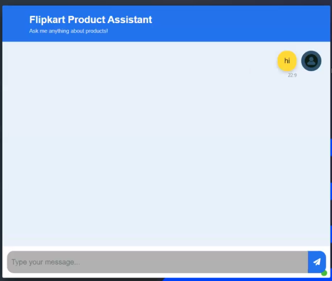

# End to End Project - Customer Support System

* We have a website - Flipkart
* We will scrap the data from flikart — webscrapper and keep it in csv
* csv can have product\_id, product\_name, product\_review, product\_rating....
* We will be storing this in vectorDB&#x20;
* On top of this we will create a RAG
* Data is in csv, we will create Document&#x20;
  * page\_content = review
  * metadata = dictionary containing product\_id
* This transformed data will be stored in vectorDB

<figure><figcaption></figcaption></figure>
