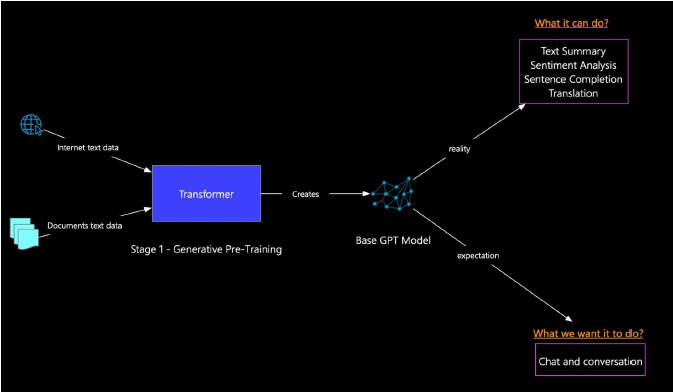

# How ChatGPT was trained

* Complete software which is using LLM GPT-3.5 Turbo, GPT-4 and GPT-4o
* It has trained on an immense amount of data available all over the internet, so its a unlabelled data
* In every LLM there will unsupervised pre training and supervised fine tuning and reward based learning

<figure><figcaption></figcaption></figure>

1. Generative pre-training

*

    <figure><figcaption></figcaption></figure>

2. Supervised fine-tuning

*

    <figure><figcaption></figcaption></figure>

3. Reinforcement learning

*

    <figure><figcaption></figcaption></figure>
