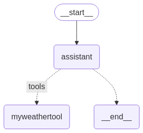

# LangGraph Agents

* &#x20;messagestate is dict of messages
* For creating tool we need tool decorator
* If we only bind the tool, they it just tell that tool but we need to orchestrate tool calling
* We can pass tool message to LLM to get proper message

```python
from langchain_openai import ChatOpenAI

openai_model=ChatOpenAI(model="gpt-4o")

openai_model.invoke("hi")

openai_model.invoke("hi").content
# 'Hello! How can I assist you today?'

from langgraph.graph import StateGraph,MessagesState, START, END
from langgraph.graph.message import add_messages
from typing import Annotated, Literal, TypedDict
from langchain_core.tools import tool
from langchain_core.messages import HumanMessage
from langgraph.checkpoint.memory import MemorySaver
from langgraph.prebuilt import ToolNode

state={}

state["messages"]=[]
state["messages"].append("hi")
state["messages"].append("how are you?")
# {'messages': ['hi', 'how are you?']}

def call_model(state:MessagesState):
    question=state["messages"]
    response=openai_model.invoke(question)
    return {"messages":[response]}

workflow=StateGraph(MessagesState)

workflow.add_node("chatbot",call_model)
workflow.add_edge(START,"chatbot")
workflow.add_edge("chatbot",END)'

app=workflow.compile()

from IPython.display import Image,display
display(Image(app.get_graph().draw_mermaid_png()))

input={"messages":["hi my name is sunny"]}
response=app.invoke(input)
response["messages"][-1].content
# 'Hi Sunny! How can I assist you today?'

@tool
def search(query:str):
    """this is a tool for weather checking"""
    if "india" in query.lower() or "delhi" in query.lower():
        return "the weather is hotty with some foggy"
    return "weather is cloudy with some darkness"

@tool
def search(query:str):
    """this is a tool for weather checking"""
    if "india" in query.lower() or "delhi" in query.lower():
        return "the weather is hotty with some foggy"
    return "weather is cloudy with some darkness"

search.invoke("what is a weather in japan?")
# 'weather is cloudy with some darkness'

search.invoke("what is a weather in delhi?")
# 'the weather is hotty with some foggy'

tools=[search]

llm_with_tool=openai_model.bind_tools(tools)

response=llm_with_tool.invoke("hi")
response.content # 'Hello! How can I assist you today?'
response.tool_calls # []


result=llm_with_tool.invoke("what is a weather in europ?")
result.content # ''
result.tool_calls
# [{'name': 'search',
#   'args': {'query': 'current weather in Europe'},
# 'id': 'call_tol5hOy9LHURFgg9ZAxusqT9',
#  'type': 'tool_call'}]

def call_model(state:MessagesState):
    question=state["messages"]
    response=llm_with_tool.invoke(question)
    return {"messages":[response]}
    
input={'messages': ['hi my name is sunny']}
response=call_model(input)
message=response["messages"]
last_message=message[-1]
last_message.content # 'Hello Sunny! How can I assist you today?'
last_message.tool_calls # []

input={'messages': ['what is a weather in mumbai?']}

def router_function(state: MessagesState):
    message=state["messages"]
    last_message=message[-1]
    if last_message.tool_calls:
        return "tools"
    return END

tool_node=ToolNode(tools)
workflow=StateGraph(MessagesState)
workflow.add_node("assistant",call_model)
workflow.add_node("myweathertool",tool_node)
workflow.add_edge(START, "assistant")

workflow.add_conditional_edges("assistant",
                               router_function,
                               {"tools": "myweathertool", END: END})

app = workflow.compile()

display(Image(app.get_graph().draw_mermaid_png()))

app.invoke({"messages": ["how are you?"]}) # Here we will get AI message
app.invoke({"messages": ["what is a weather in delhi?"]}) # Here we will get tool message
# {'messages': [HumanMessage(content='what is a weather in delhi?', 
# additional_kwargs={}, response_metadata={}, id='ab97e960-4f75-4bc2-b33d-2e71af5e9636'),
#  AIMessage(content='', additional_kwargs={'tool_calls':
# [{'id': 'call_yGUyksdfre0oMUxMjgvXqlDE', 'function': {'arguments': 
#'{"query":"current weather in Delhi"}', 'name': 'search'}, 'type': 'function'}],
# 'refusal': None}, response_metadata={'token_usage': {'completion_tokens': 17, 
# 'prompt_tokens': 52, 'total_tokens': 69, 'completion_tokens_details':
# {'accepted_prediction_tokens': 0, 'audio_tokens': 0, 'reasoning_tokens': 0, 
# 'rejected_prediction_tokens': 0}, 'prompt_tokens_details': {'audio_tokens': 0, 
# 'cached_tokens': 0}}, 'model_name': 'gpt-4o-2024-08-06', 'system_fingerprint':
# 'fp_92f14e8683', 'finish_reason': 'tool_calls', 'logprobs': None}, 
# id='run-285abba1-b433-40a6-a6c4-c7cab0b01878-0',
#  tool_calls=[{'name': 'search', 'args': {'query': 'current weather in Delhi'},
# 'id': 'call_yGUyksdfre0oMUxMjgvXqlDE', 'type': 'tool_call'}],
# usage_metadata={'input_tokens': 52, 'output_tokens': 17, 'total_tokens': 69, 
# 'input_token_details': {'audio': 0, 'cache_read': 0}, 'output_token_details': 
# {'audio': 0, 'reasoning': 0}}),
#  ToolMessage(content='the weather is hotty with some foggy',
# name='search', id='43de9746-9699-4b7c-9f90-7b8a7006e47d', 
# tool_call_id='call_yGUyksdfre0oMUxMjgvXqlDE')]}

workflow.add_edge("myweathertool","assistant")
app = workflow.compile()
display(Image(app.get_graph().draw_mermaid_png()))

app.invoke({"messages": ["what is a weather in delhi?"]})
# {'messages': [HumanMessage(content='what is a weather in delhi?',
# additional_kwargs={}, response_metadata={}, id='a61d43f6-a7ab-411e-b5f2-d3036f07ddf1'),
#  AIMessage(content='', additional_kwargs={'tool_calls': 
#[{'id': 'call_Pn87PZzbsUUYACk0VKthO2P3', 'function': {'arguments': '
# {"query":"weather in Delhi"}', 'name': 'search'}, 'type': 'function'}], 
#'refusal': None}, response_metadata={'token_usage': {'completion_tokens': 16,
# 'prompt_tokens': 52, 'total_tokens': 68, 'completion_tokens_details': 
# {'accepted_prediction_tokens': 0, 'audio_tokens': 0, 'reasoning_tokens': 0,
# 'rejected_prediction_tokens': 0}, 'prompt_tokens_details': {'audio_tokens': 0, 
# 'cached_tokens': 0}}, 'model_name': 'gpt-4o-2024-08-06', 'system_fingerprint': 
# 'fp_92f14e8683', 'finish_reason': 'tool_calls', 'logprobs': None},
# id='run-a19fc966-7252-4855-9a4d-dba03fa17b96-0', tool_calls=[{'name':
# 'search', 'args': {'query': 'weather in Delhi'}, 'id': 'call_Pn87PZzbsUUYACk0VKthO2P3',
# 'type': 'tool_call'}], usage_metadata={'input_tokens': 52, 'output_tokens': 16, 
#'total_tokens': 68, 'input_token_details': {'audio': 0, 'cache_read': 0},
# 'output_token_details': {'audio': 0, 'reasoning': 0}}),
#  ToolMessage(content='the weather is hotty with some foggy', name='search',
# id='053284c1-4533-4453-b57b-4d9478ac3a44', tool_call_id='call_Pn87PZzbsUUYACk0VKthO2P3'),
#  AIMessage(content='The weather in Delhi is currently hot with some foggy conditions.',
# additional_kwargs={'refusal': None}, response_metadata={'token_usage':
# {'completion_tokens': 15, 'prompt_tokens': 83, 'total_tokens': 98, 
#'completion_tokens_details': {'accepted_prediction_tokens': 0, 'audio_tokens': 0,
# 'reasoning_tokens': 0, 'rejected_prediction_tokens': 0}, 'prompt_tokens_details':
# {'audio_tokens': 0, 'cached_tokens': 0}}, 'model_name': 'gpt-4o-2024-08-06',
# 'system_fingerprint': 'fp_92f14e8683', 'finish_reason': 'stop', 'logprobs': None},
# id='run-0809079c-dd78-4122-9a22-51d168a5982b-0', usage_metadata={'input_tokens': 83,
# 'output_tokens': 15, 'total_tokens': 98, 'input_token_details': {'audio': 0,
# 'cache_read': 0}, 'output_token_details': {'audio': 0, 'reasoning': 0}})]}
```

*

    <figure><figcaption></figcaption></figure>


*

    <figure><figcaption></figcaption></figure>
*

    <figure><figcaption></figcaption></figure>
