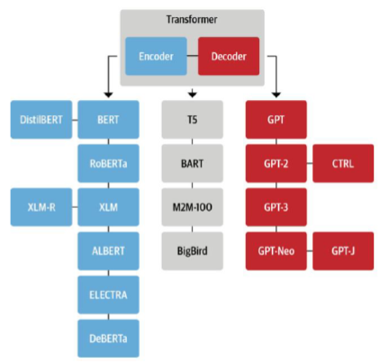

# Transformers: Architecture Behind LLMs

* Invented by Google
* Inside the transformer there are 2 major sections - Encoder and Decoder
* We can use the encoder and decoder separately
*

    <figure><figcaption></figcaption></figure>
* We can have architecture based on either encoder or decoder or both
* Before LLM we were using encoder based architecture we were using for text classification/summarization
* Encoder and Decoder together were used for translation
* Decoder was used for text generation
*   In modern era ChatGPT 3.5 turbo came, which was capable of doing everything

    <figure><figcaption></figcaption></figure>
